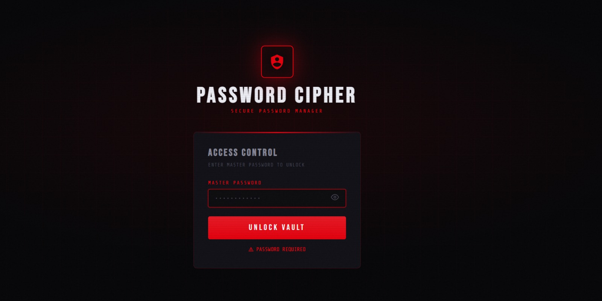
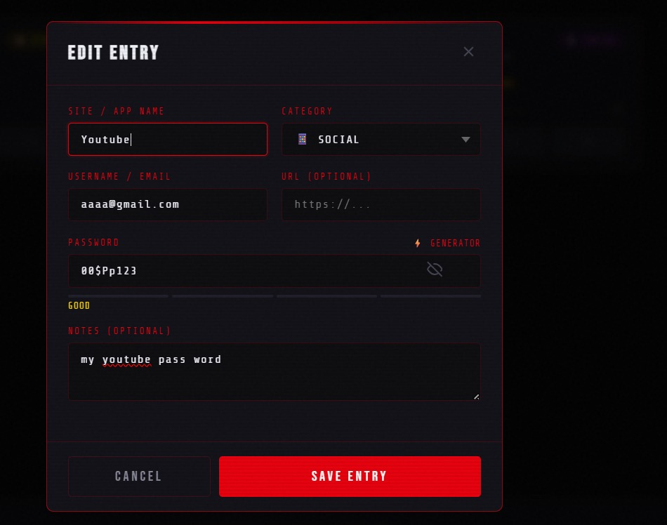
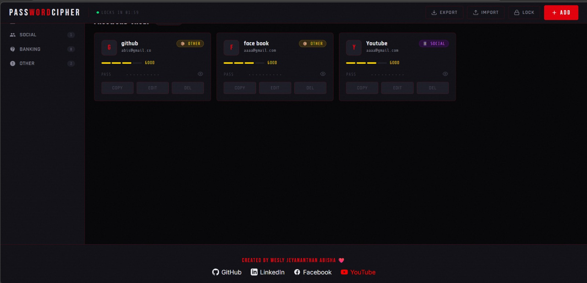

# 🔐 Password Cipher

**A Secure & Stylish Offline Password Manager**

A beautiful cyberpunk-style password manager with AES encryption, built using HTML, CSS, and JavaScript.

## 📸 Screenshots

### 1. Login Screen

### 2. Main Vault Interface

### 3. Password Cards & Generator

## ✨ Features

- Master Password protection with SHA-256 hashing
- AES-256 Encryption using CryptoJS (fully client-side)
- Built-in Strong Password Generator with customizable options
- Auto-lock after 2 minutes of inactivity
- Categories: Work, Social, Banking, Other
- Search and Filter functionality
- Export / Import vault as JSON
- Password Strength Meter
- Stunning dark cyberpunk UI with scanlines and noise effects
- Fully responsive design

## 🚀 How to Use

1. Download or clone this repository
2. Open `index.html` in any modern browser (Chrome, Firefox, or Edge recommended)
3. Set your **Master Password** on first use (remember it — it cannot be recovered)
4. Click the **+ ADD** button to store your passwords

> **Important**: All your data is stored locally in your browser. Nothing is sent to any server.

## 🛠 Tech Stack

- HTML5, CSS3 & Vanilla JavaScript
- [CryptoJS](https://github.com/brix/crypto-js) for AES encryption and SHA-256
- Google Fonts (Bebas Neue, Share Tech Mono, Rajdhani, Inter)

## 📁 Project Structure
password-cipher/

├── index.html

├── style.css

├── script.js

├── image/
│   ├── Output1.jpg
│   ├── Output2.jpg
   └── Output3.jpg
   
├── README.md

## 🔒 Security Notes

- Master password is hashed and never stored in plain text
- All passwords are encrypted locally using AES-256
- No data leaves your device
- Fully offline and private

## ❤️ Created by

**Wesly Jeyananthan Abisha**

- GitHub: [@Abisha71](https://github.com/Abisha71)
- LinkedIn: [Abisha Wesly](https://www.linkedin.com/in/abisha-wesly-jeyananthan-2a05a32b8)
- Facebook: [Profile](https://www.facebook.com/share/18DbpQMBMf/)
- YouTube: [@shaabi-u5k](https://youtube.com/@shaabi-u5k)

**Made with ❤️ in Sri Lanka**

### Live Demo

https://abisha71.github.io/Password-Cipher/

